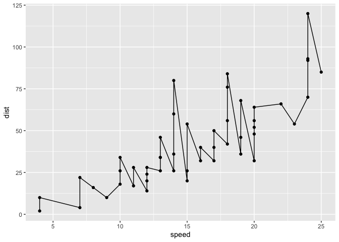
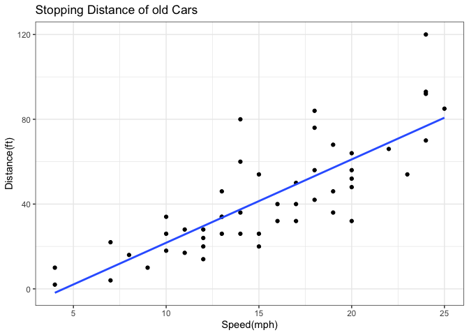
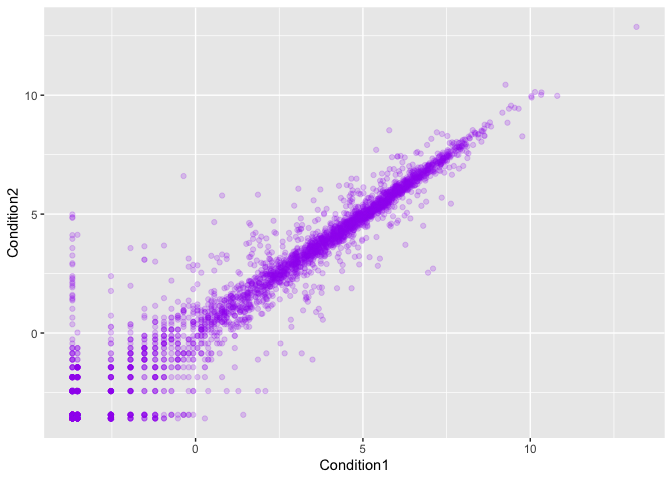
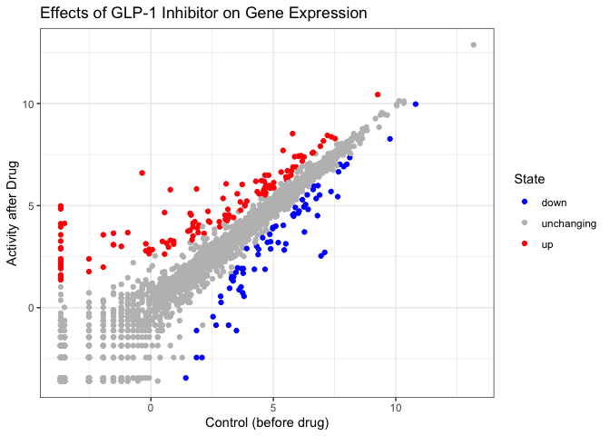
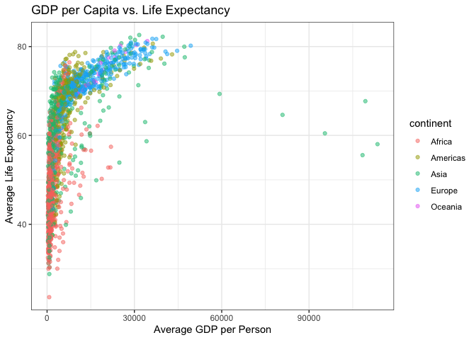
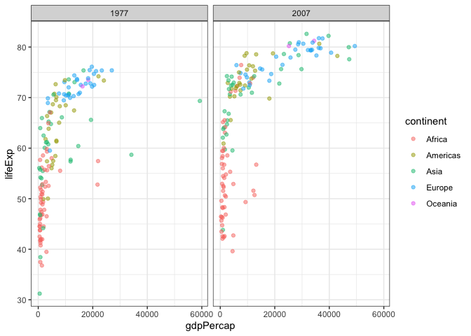

# Class 5: Data Viz with ggplot
Paul Brencick (PID:A17668863)

- [Background](#background)
- [Gene Expression Plot](#gene-expression-plot)
- [Going further with gapmider](#going-further-with-gapmider)
- [First look at the dplyer package](#first-look-at-the-dplyer-package)

## Background

Wow we have so many *ways* to create a **plot** in R! These include
so-called “base R” (like `plot()`) and add on packages like **ggplot2**.

We are going to create the same plot with the 2 different graphics
systems. We are able to use the inbuilt `cars` dataset:

``` r
head(cars)
```

      speed dist
    1     4    2
    2     4   10
    3     7    4
    4     7   22
    5     8   16
    6     9   10

Using “base R” we are able to simple do:

``` r
plot(cars)
```


Now lets make a ggplot instead. However, first we need to install the
package using `install.packages("ggplot2")`

> **N.B.** We should never run install.packages in a code chunk
> otherwise it will be re-installed needlessly every time we render to
> check.

Every time we need to use an add-on, we need to load it up via a call to
`library()`

``` r
library(ggplot2)
ggplot(cars)
```


Every ggplot needs 3 things

1.  The **data** (i.e things we are going to plot as a data.frame)
2.  The **aes** or aesthetics which map the data to the plot
3.  The **geom\_** or geometry (i.e the type of plot)

``` r
ggplot(cars) +
  aes(x=speed, y=dist) +
  geom_point() +
  geom_line()
```



``` r
ggplot(cars) +
  aes(x=speed, y=dist) +
  geom_point() +
  geom_smooth(method="lm", se=FALSE) +
  labs(x="Speed(mph)",
       y="Distance(ft)",
       title="Stopping Distance of old Cars") +
  theme_bw()
```

    `geom_smooth()` using formula = 'y ~ x'



## Gene Expression Plot

Read some data on the effects of GLP-1 inhibitor (drug) on gene
expression values:

``` r
url <- "https://bioboot.github.io/bimm143_S20/class-material/up_down_expression.txt"
genes <- read.delim(url)
head(genes)
```

            Gene Condition1 Condition2      State
    1      A4GNT -3.6808610 -3.4401355 unchanging
    2       AAAS  4.5479580  4.3864126 unchanging
    3      AASDH  3.7190695  3.4787276 unchanging
    4       AATF  5.0784720  5.0151916 unchanging
    5       AATK  0.4711421  0.5598642 unchanging
    6 AB015752.4 -3.6808610 -3.5921390 unchanging

Version 1 plot - start simple by getting some data on the page.

``` r
ggplot(genes) +
  aes(x=Condition1, y=Condition2) +
  geom_point(col="purple", alpha=0.2)
```



Lets color by `State` up, down, or no change.

``` r
table(genes$State)
```


          down unchanging         up 
            72       4997        127 

``` r
ggplot(genes) +
  aes(x=Condition1, y=Condition2, col=State) +
  geom_point() +
  scale_color_manual(values=c("blue","gray","red")) +
  labs(x="Control (before drug)",
       y="Activity after Drug",
       title="Effects of GLP-1 Inhibitor on Gene Expression") +
  theme_bw()
```



## Going further with gapmider

Now, lets explore the famous `gapmider` dataset via some custom plots.

``` r
url <- "https://raw.githubusercontent.com/jennybc/gapminder/master/inst/extdata/gapminder.tsv"

gapminder <- read.delim(url)
head(gapminder)
```

          country continent year lifeExp      pop gdpPercap
    1 Afghanistan      Asia 1952  28.801  8425333  779.4453
    2 Afghanistan      Asia 1957  30.332  9240934  820.8530
    3 Afghanistan      Asia 1962  31.997 10267083  853.1007
    4 Afghanistan      Asia 1967  34.020 11537966  836.1971
    5 Afghanistan      Asia 1972  36.088 13079460  739.9811
    6 Afghanistan      Asia 1977  38.438 14880372  786.1134

> Q. How many rows does this dataset have?

``` r
nrow(gapminder)
```

    [1] 1704

> Q. How many different continents are in this dataset?

``` r
table(gapminder$continent)
```


      Africa Americas     Asia   Europe  Oceania 
         624      300      396      360       24 

Version 1 plot - gdpPercap vs LifeExp for all rows

``` r
ggplot(gapminder) +
  aes(gdpPercap, lifeExp,col=continent) +
  geom_point(alpha=0.5) +
  labs(x="Average GDP per Person",
       y="Average Life Expectancy",
       title="GDP per Capita vs. Life Expectancy") +
  theme_bw()
```



I want to see a plot for each continent - in ggplot lingo this is called
“faceting”

``` r
ggplot(gapminder) +
  aes(gdpPercap, lifeExp,col=continent) +
  geom_point(alpha=0.5) +
  facet_wrap(~continent) +
  theme_bw()
```


## First look at the dplyer package

Another add-on package with a function called `filter()` which I want to
use.

``` r
library(dplyr)
```


    Attaching package: 'dplyr'

    The following objects are masked from 'package:stats':

        filter, lag

    The following objects are masked from 'package:base':

        intersect, setdiff, setequal, union

``` r
filter(gapminder, year==2007,country=="Vietnam")
```

      country continent year lifeExp      pop gdpPercap
    1 Vietnam      Asia 2007  74.249 85262356  2441.576

``` r
imput <- filter(gapminder, year==1977 | year ==2007)
```

``` r
ggplot(imput) +
  aes(gdpPercap, lifeExp, col=continent) +
    facet_wrap(~year) +
  geom_point(alpha=0.5) +
  theme_bw()
```


