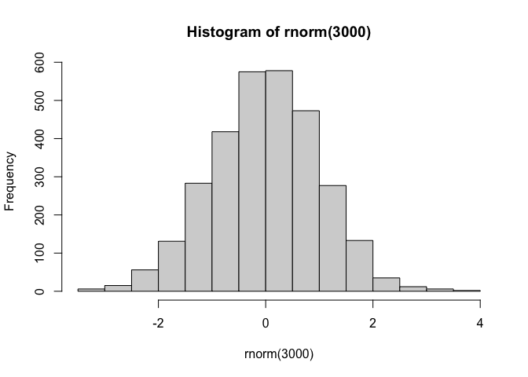
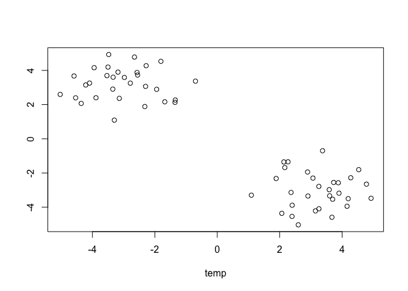
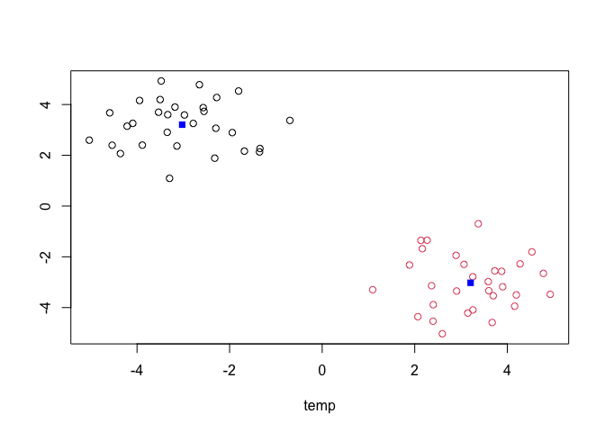
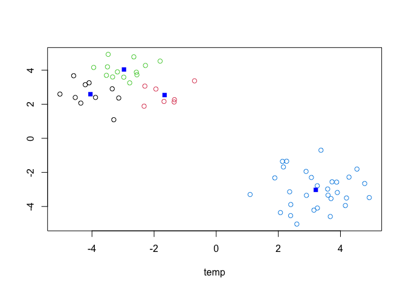
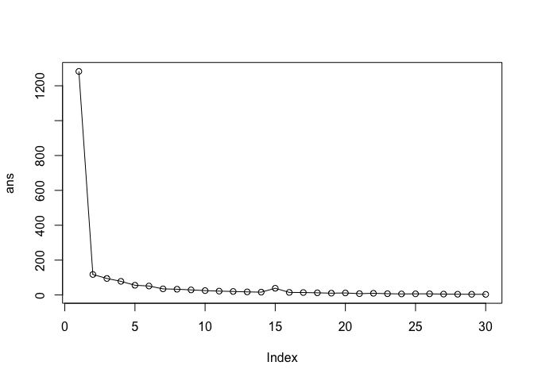
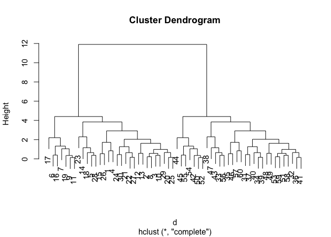
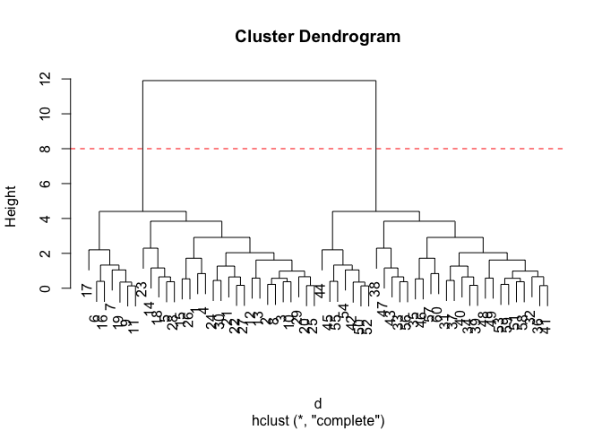

# Class 7: Machine Learning 1
Paul Brencick (A17668863)

- [Background](#background)
- [K-means Clustering](#k-means-clustering)
- [Hierarchial Clustering](#hierarchial-clustering)
- [PCA of UK food data](#pca-of-uk-food-data)
- [Spotting major differences and
  trends](#spotting-major-differences-and-trends)
- [Pairs plots and heatmaps](#pairs-plots-and-heatmaps)
- [PCA to the rescue!](#pca-to-the-rescue)

## Background

Today we are going to begin our exploration of some important machine
learning methods, namely **clustering** and **dimensionality
reduction**.

We are going to make up some input data for clustering where we know
what the natural “clusters” are.

The function `rnorm()` can be helpful here.

``` r
hist(rnorm(3000))
```



> Q. Generate 30 random numbers centered around +3 and another 30
> centered at -3.

``` r
temp <- c(rnorm(30,3),
         rnorm(30,-3) )

x <- cbind(temp, rev(temp))
plot(x)
```



## K-means Clustering

The main function in “base R” for K-means clustering is called
`kmeans()`.

``` r
km <- kmeans(x,2)
km
```

    K-means clustering with 2 clusters of sizes 30, 30

    Cluster means:
           temp          
    1 -3.024380  3.206552
    2  3.206552 -3.024380

    Clustering vector:
     [1] 2 2 2 2 2 2 2 2 2 2 2 2 2 2 2 2 2 2 2 2 2 2 2 2 2 2 2 2 2 2 1 1 1 1 1 1 1 1
    [39] 1 1 1 1 1 1 1 1 1 1 1 1 1 1 1 1 1 1 1 1 1 1

    Within cluster sum of squares by cluster:
    [1] 58.85129 58.85129
     (between_SS / total_SS =  90.8 %)

    Available components:

    [1] "cluster"      "centers"      "totss"        "withinss"     "tot.withinss"
    [6] "betweenss"    "size"         "iter"         "ifault"      

> Q. What component of the result object details the cluster sizes?

``` r
km$size
```

    [1] 30 30

> Q. What component of the results object details the cluster centers?

``` r
km$centers
```

           temp          
    1 -3.024380  3.206552
    2  3.206552 -3.024380

> Q. What component of the results object details the cluster membership
> vector (ie. our main result of which points lie in which cluster)?

``` r
km$cluster
```

     [1] 2 2 2 2 2 2 2 2 2 2 2 2 2 2 2 2 2 2 2 2 2 2 2 2 2 2 2 2 2 2 1 1 1 1 1 1 1 1
    [39] 1 1 1 1 1 1 1 1 1 1 1 1 1 1 1 1 1 1 1 1 1 1

> Q. Plot our clustering results with points colored by cluster and also
> add the cluster center as a new points colored blue?

``` r
plot(x, col=km$cluster)
points(km$centers, col="blue", pch=15)
```



> Q. Run `kmeans()` again and this time produce 4 clusters (and call
> your results object `k4`) and make a result figure like above?

``` r
k4 <- kmeans(x,4)
```

``` r
plot(x, col=k4$cluster)
points(k4$centers, col="blue", pch=15)
```



The metric

``` r
km$tot.withinss
```

    [1] 117.7026

``` r
k4$tot.withinss
```

    [1] 78.23949

> Q. Let’s try different number of k (centers) from 1 to 30 and see what
> the best result is?

``` r
i <-  1
ans <- NULL
for(i in 1:30) {
ans <- c(ans, kmeans(x, centers=i)$tot.withinss)
}
```

``` r
plot(ans, typ="o")
```



**N.B** When you ask for excessive amounts of clusters, it will give you
an output however it is fairly obvious on how many cluster is optimal.

## Hierarchial Clustering

The main function for hierarchical clustering is called `hclust()`.
Unlike `kmeans()` (which does all the work for you) you can’t just pass
`hclust()` our raw input data. It needs a “distance matrix” like the one
returned from the `dist()` function.

``` r
d <- dist(x)
hc <- hclust(d)
plot(hc)
```



To extract our clusters membership vector from a `hclust()` result
object we have to “cut” our tree at a given height to yield separate
“groups” or “branches”.

``` r
plot(hc)
abline(h=8,col="red",lty=2)
```



To do this we use the `cuttree()` function on our `hclust()`.

``` r
groups <- cutree(hc,h=8)
groups
```

     [1] 1 1 1 1 1 1 1 1 1 1 1 1 1 1 1 1 1 1 1 1 1 1 1 1 1 1 1 1 1 1 2 2 2 2 2 2 2 2
    [39] 2 2 2 2 2 2 2 2 2 2 2 2 2 2 2 2 2 2 2 2 2 2

``` r
table(groups,km$cluster)
```

          
    groups  1  2
         1  0 30
         2 30  0

## PCA of UK food data

Import the dataset of food consumption in the UK

``` r
url <- "https://tinyurl.com/UK-foods"
x <- read.csv(url)
x
```

                         X England Wales Scotland N.Ireland
    1               Cheese     105   103      103        66
    2        Carcass_meat      245   227      242       267
    3          Other_meat      685   803      750       586
    4                 Fish     147   160      122        93
    5       Fats_and_oils      193   235      184       209
    6               Sugars     156   175      147       139
    7      Fresh_potatoes      720   874      566      1033
    8           Fresh_Veg      253   265      171       143
    9           Other_Veg      488   570      418       355
    10 Processed_potatoes      198   203      220       187
    11      Processed_Veg      360   365      337       334
    12        Fresh_fruit     1102  1137      957       674
    13            Cereals     1472  1582     1462      1494
    14           Beverages      57    73       53        47
    15        Soft_drinks     1374  1256     1572      1506
    16   Alcoholic_drinks      375   475      458       135
    17      Confectionery       54    64       62        41

> Q1. How many rows and columns are in your new data frame named x? What
> R functions could you use to answer this questions?

``` r
dim(x)
```

    [1] 17  5

One solution to set the row names is to do it by hand…

``` r
rownames(x) <- x[,1]
```

To remove the first column I can use the minus index method

``` r
x <- x[,-1]
```

A better way to do this would be to set the row name for the first
column by arguing with `read.csv()`

``` r
x <- read.csv(url,row.names=1)
x
```

                        England Wales Scotland N.Ireland
    Cheese                  105   103      103        66
    Carcass_meat            245   227      242       267
    Other_meat              685   803      750       586
    Fish                    147   160      122        93
    Fats_and_oils           193   235      184       209
    Sugars                  156   175      147       139
    Fresh_potatoes          720   874      566      1033
    Fresh_Veg               253   265      171       143
    Other_Veg               488   570      418       355
    Processed_potatoes      198   203      220       187
    Processed_Veg           360   365      337       334
    Fresh_fruit            1102  1137      957       674
    Cereals                1472  1582     1462      1494
    Beverages                57    73       53        47
    Soft_drinks            1374  1256     1572      1506
    Alcoholic_drinks        375   475      458       135
    Confectionery            54    64       62        41

> Q2. Which approach to solving the ‘row-names problem’ mentioned above
> do you prefer and why? Is one approach more robust than another under
> certain circumstances?

I prefer to set the row name by messing with the read.csv as it is a
much more future proof method of completing the task. It is also one
less step to do.

## Spotting major differences and trends

It is difficult even in this 17D dataset….

``` r
barplot(as.matrix(x), beside=T, col=rainbow(nrow(x)))
```


``` r
barplot(as.matrix(x), beside=F, col=rainbow(nrow(x)))
```


## Pairs plots and heatmaps

``` r
pairs(x, col=rainbow(nrow(x)), pch=16)
```


``` r
library(pheatmap)

pheatmap( as.matrix(x) )
```


## PCA to the rescue!

The main PCA function in “base R” is called `prcomp()`. This function
wants the transpose of our food data as input (ie. the foods as columns
and the countries as rows).

``` r
pca <- prcomp(t(x))
```

``` r
summary(pca)
```

    Importance of components:
                                PC1      PC2      PC3     PC4
    Standard deviation     324.1502 212.7478 73.87622 2.7e-14
    Proportion of Variance   0.6744   0.2905  0.03503 0.0e+00
    Cumulative Proportion    0.6744   0.9650  1.00000 1.0e+00

To make one of the main PCA result figures, we turn to `pca$x` the
scores along our new PCS. This is called “PC plot” or “Score Plot” or
“Ordination Plot”…

``` r
my_cols <- c("orange","red","blue","darkgreen")
```

``` r
library(ggplot2)

ggplot(pca$x) + 
  aes(PC1, PC2) +
  geom_point(col=my_cols)
```


The second major result figure is called a “loading plot” of “variable
contributions plot” or “weight plot”

``` r
ggplot(pca$rotation) +
  aes(x = PC1, 
      y = reorder(rownames(pca$rotation), PC1)) +
  geom_col(fill = "steelblue") +
  xlab("PC1 Loading Score") +
  ylab("") +
  theme_bw() +
  theme(axis.text.y = element_text(size = 9))
```


