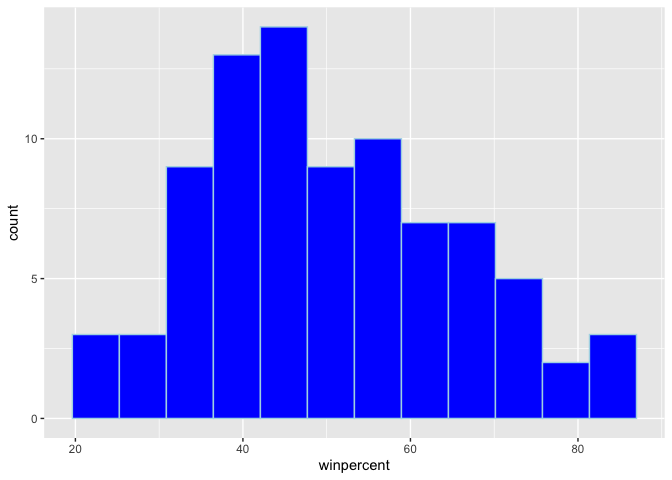
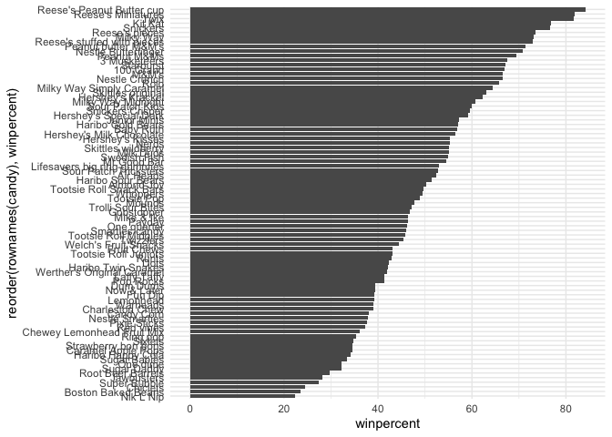
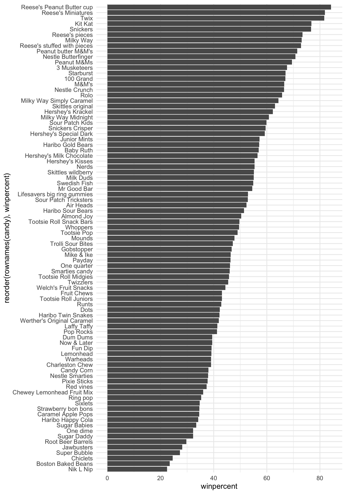
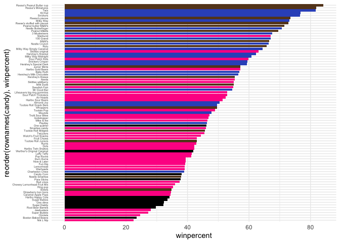
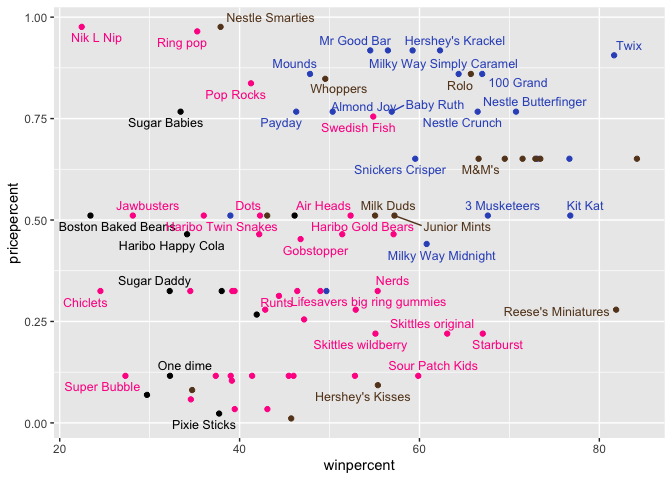
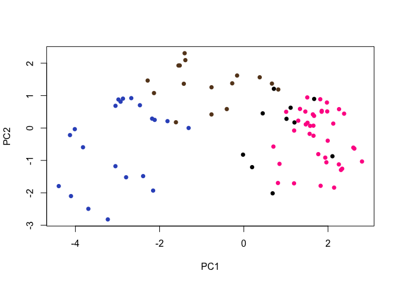
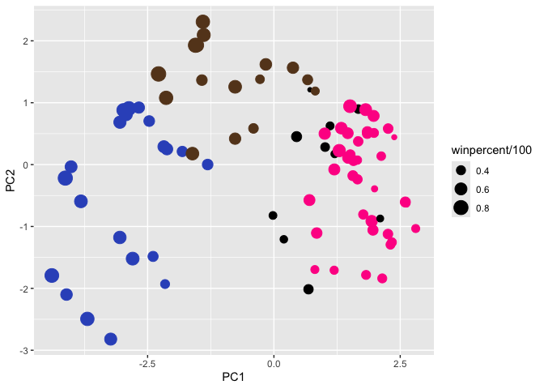
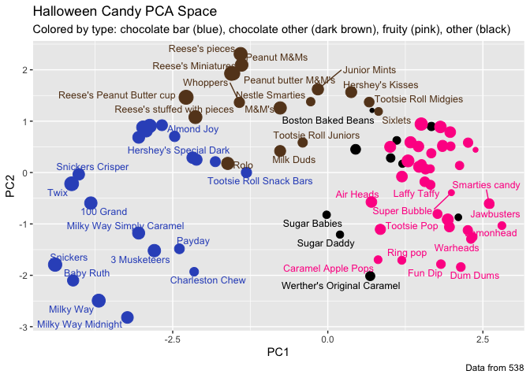

# Class 9: Candy Mini-Project
Paul Brencick (PID: A17668863)

- [Background](#background)
- [Importing the Candy Data](#importing-the-candy-data)
- [Exploratory analysis](#exploratory-analysis)
- [Overall Candy Rankings](#overall-candy-rankings)
- [Analyzing Price Percent](#analyzing-price-percent)
- [Exploring the correlation
  structure](#exploring-the-correlation-structure)
- [Principal Component Analysis](#principal-component-analysis)

## Background

In this project, we are going to look at data from a website which asked
its readers to pick their favorite candies. We are going to explore this
dataset and figure out some trends among the candies. By the end, I
should be able to predict what candy you may like based off your
favorite ones.

## Importing the Candy Data

First we need to import the dataset into R. Remember we need to make
sure the candy names are not supposed to be a column so we set the
`row.names=1`.

``` r
candy_file <- "https://raw.githubusercontent.com/fivethirtyeight/data/master/candy-power-ranking/candy-data.csv"

candy = read.csv(candy_file, row.names=1)
head(candy)
```

                 chocolate fruity caramel peanutyalmondy nougat crispedricewafer
    100 Grand            1      0       1              0      0                1
    3 Musketeers         1      0       0              0      1                0
    One dime             0      0       0              0      0                0
    One quarter          0      0       0              0      0                0
    Air Heads            0      1       0              0      0                0
    Almond Joy           1      0       0              1      0                0
                 hard bar pluribus sugarpercent pricepercent winpercent
    100 Grand       0   1        0        0.732        0.860   66.97173
    3 Musketeers    0   1        0        0.604        0.511   67.60294
    One dime        0   0        0        0.011        0.116   32.26109
    One quarter     0   0        0        0.011        0.511   46.11650
    Air Heads       0   0        0        0.906        0.511   52.34146
    Almond Joy      0   1        0        0.465        0.767   50.34755

> Q1. How many different candy types are in this dataset?

``` r
nrow(candy)
```

    [1] 85

> Q2. How many fruity candy types are in the dataset?

``` r
sum(candy$fruity)
```

    [1] 38

Within the dataset, there is a variable named **winpercent**, a
percentage of people who prefer this candy over another randomly chosen
candy from the dataset

``` r
candy["Twix", ]$winpercent
```

    [1] 81.64291

> Q3. What is your favorite candy (other than Twix) in the dataset and
> what is it’s winpercent value?

``` r
candy["Reese's Peanut Butter cup",]$winpercent
```

    [1] 84.18029

> Q4. What is the winpercent value for “Kit Kat”?

``` r
candy["Kit Kat",]$winpercent
```

    [1] 76.7686

> Q5. What is the winpercent value for “Tootsie Roll Snack Bars”?

The win percent value for tootsie roll snack bars is 49.653503

**N.B** The skim package can be helpful in quick analysis of a data set.

``` r
library("skimr")
skim(candy)
```

|                                                  |       |
|:-------------------------------------------------|:------|
| Name                                             | candy |
| Number of rows                                   | 85    |
| Number of columns                                | 12    |
| \_\_\_\_\_\_\_\_\_\_\_\_\_\_\_\_\_\_\_\_\_\_\_   |       |
| Column type frequency:                           |       |
| numeric                                          | 12    |
| \_\_\_\_\_\_\_\_\_\_\_\_\_\_\_\_\_\_\_\_\_\_\_\_ |       |
| Group variables                                  | None  |

Data summary

**Variable type: numeric**

| skim_variable | n_missing | complete_rate | mean | sd | p0 | p25 | p50 | p75 | p100 | hist |
|:---|---:|---:|---:|---:|---:|---:|---:|---:|---:|:---|
| chocolate | 0 | 1 | 0.44 | 0.50 | 0.00 | 0.00 | 0.00 | 1.00 | 1.00 | ▇▁▁▁▆ |
| fruity | 0 | 1 | 0.45 | 0.50 | 0.00 | 0.00 | 0.00 | 1.00 | 1.00 | ▇▁▁▁▆ |
| caramel | 0 | 1 | 0.16 | 0.37 | 0.00 | 0.00 | 0.00 | 0.00 | 1.00 | ▇▁▁▁▂ |
| peanutyalmondy | 0 | 1 | 0.16 | 0.37 | 0.00 | 0.00 | 0.00 | 0.00 | 1.00 | ▇▁▁▁▂ |
| nougat | 0 | 1 | 0.08 | 0.28 | 0.00 | 0.00 | 0.00 | 0.00 | 1.00 | ▇▁▁▁▁ |
| crispedricewafer | 0 | 1 | 0.08 | 0.28 | 0.00 | 0.00 | 0.00 | 0.00 | 1.00 | ▇▁▁▁▁ |
| hard | 0 | 1 | 0.18 | 0.38 | 0.00 | 0.00 | 0.00 | 0.00 | 1.00 | ▇▁▁▁▂ |
| bar | 0 | 1 | 0.25 | 0.43 | 0.00 | 0.00 | 0.00 | 0.00 | 1.00 | ▇▁▁▁▂ |
| pluribus | 0 | 1 | 0.52 | 0.50 | 0.00 | 0.00 | 1.00 | 1.00 | 1.00 | ▇▁▁▁▇ |
| sugarpercent | 0 | 1 | 0.48 | 0.28 | 0.01 | 0.22 | 0.47 | 0.73 | 0.99 | ▇▇▇▇▆ |
| pricepercent | 0 | 1 | 0.47 | 0.29 | 0.01 | 0.26 | 0.47 | 0.65 | 0.98 | ▇▇▇▇▆ |
| winpercent | 0 | 1 | 50.32 | 14.71 | 22.45 | 39.14 | 47.83 | 59.86 | 84.18 | ▃▇▆▅▂ |

> Q6. Is there any variable/column that looks to be on a different scale
> to the majority of the other columns in the dataset?

Yes, the `winpercent` variable appears to be on a different scale from
the other columns. Its mean is 50.31676381 while the others under 1.

> Q7. What do you think a zero and one represent for the
> candy\$chocolate column?

The 0 and 1 likely represent binary, which means that the 0 or 1s are
true or false. In this data set, a 1 would mean that the candy has some
sort chocolate apart of it.

## Exploratory analysis

> Q8. Plot a histogram of winpercent values using both base R an
> ggplot2.

``` r
hist(candy$winpercent)
```


``` r
library(ggplot2)
ggplot(candy, aes(winpercent)) +
  geom_histogram(bins=12,fill="blue", col="light blue")
```



> Q9. Is the distribution of winpercent values symmetrical?

The distribution of winpercent value is not symmetrical. Most of the
candies fall between 35-50%. It is apparent in both histograms there is
a longer tail on the right end.

> Q10. Is the center of the distribution above or below 50%?

``` r
mean(candy$winpercent)
```

    [1] 50.31676

The center of the distribution is above 50% with a mean of 50.31676.

> Q11. On average is chocolate candy higher or lower ranked than fruit
> candy?

``` r
mean(candy$winpercent[candy$chocolate == 1])
```

    [1] 60.92153

``` r
mean(candy$winpercent[candy$fruity == 1])
```

    [1] 44.11974

On average, chocolate candy is higher ranked than fruit candy with a
mean winpercent of 60.9215294 compared to the mean of fruit, 44.1197414.

> Q12. Is this difference statistically significant?

``` r
t.test(candy$winpercent[candy$chocolate == 1],
      candy$winpercent[candy$fruity == 1]
)
```


        Welch Two Sample t-test

    data:  candy$winpercent[candy$chocolate == 1] and candy$winpercent[candy$fruity == 1]
    t = 6.2582, df = 68.882, p-value = 2.871e-08
    alternative hypothesis: true difference in means is not equal to 0
    95 percent confidence interval:
     11.44563 22.15795
    sample estimates:
    mean of x mean of y 
     60.92153  44.11974 

Based on the `t.test()` the difference of percents is statistically
significant. The p-value of the test was 2.871e-08 which is far below
the significance threshold of 0.05.

## Overall Candy Rankings

> Q13. What are the five least liked candy types in this set?

``` r
head(candy[order(candy$winpercent),], n=5)
```

                       chocolate fruity caramel peanutyalmondy nougat
    Nik L Nip                  0      1       0              0      0
    Boston Baked Beans         0      0       0              1      0
    Chiclets                   0      1       0              0      0
    Super Bubble               0      1       0              0      0
    Jawbusters                 0      1       0              0      0
                       crispedricewafer hard bar pluribus sugarpercent pricepercent
    Nik L Nip                         0    0   0        1        0.197        0.976
    Boston Baked Beans                0    0   0        1        0.313        0.511
    Chiclets                          0    0   0        1        0.046        0.325
    Super Bubble                      0    0   0        0        0.162        0.116
    Jawbusters                        0    1   0        1        0.093        0.511
                       winpercent
    Nik L Nip            22.44534
    Boston Baked Beans   23.41782
    Chiclets             24.52499
    Super Bubble         27.30386
    Jawbusters           28.12744

> Q14. What are the top 5 all time favorite candy types out of this set?

``` r
head(candy[order(candy$winpercent, decreasing = TRUE),], n=5)
```

                              chocolate fruity caramel peanutyalmondy nougat
    Reese's Peanut Butter cup         1      0       0              1      0
    Reese's Miniatures                1      0       0              1      0
    Twix                              1      0       1              0      0
    Kit Kat                           1      0       0              0      0
    Snickers                          1      0       1              1      1
                              crispedricewafer hard bar pluribus sugarpercent
    Reese's Peanut Butter cup                0    0   0        0        0.720
    Reese's Miniatures                       0    0   0        0        0.034
    Twix                                     1    0   1        0        0.546
    Kit Kat                                  1    0   1        0        0.313
    Snickers                                 0    0   1        0        0.546
                              pricepercent winpercent
    Reese's Peanut Butter cup        0.651   84.18029
    Reese's Miniatures               0.279   81.86626
    Twix                             0.906   81.64291
    Kit Kat                          0.511   76.76860
    Snickers                         0.651   76.67378

> Q15. Make a first barplot of candy ranking based on winpercent values.

``` r
library(ggplot2)

ggplot(candy) + 
  aes(winpercent, rownames(candy)) +
  geom_col()
```


We first created our starter plot which is very very ugly. The text is
all jumbled up and the bars are all over the place. Lets make it look
better…

> Q16. This is quite ugly, use the reorder() function to get the bars
> sorted by winpercent?

``` r
library(ggplot2)

ggplot(candy) + 
  aes(winpercent, reorder(rownames(candy),winpercent)) +
  geom_col()+
  theme_minimal()
```



``` r
ggsave("barplot1.png", height=10, width=7)
```

 Lets add color to the graph
to make it easier to read!

``` r
my_cols=rep("black", nrow(candy))
my_cols[as.logical(candy$chocolate)] = "#654321"
my_cols[as.logical(candy$bar)] = "#3556C4"
my_cols[as.logical(candy$fruity)] = "#ff1493"
```

``` r
ggplot(candy) + 
  aes(winpercent, reorder(rownames(candy),winpercent)) +
  geom_col(fill=my_cols)+
  theme_minimal() +
  theme(axis.text.y = element_text(size = 4))
```



> Q17. What is the worst ranked chocolate candy?

The worst rated chocolate candy is **Sixlets**.

> Q18. What is the best ranked fruity candy?

The best rated fruit candy is **Starburst**.

## Analyzing Price Percent

Now lets look at **Price percent** aka the best candy for the least
amount of money. We can do this by making a plot of winpercent vs the
pricepercent variable.

``` r
library(ggrepel)

ggplot(candy) +
  aes(winpercent, pricepercent, label=rownames(candy)) +
  geom_point(col=my_cols) + 
  geom_text_repel(col=my_cols, size=3.3, max.overlaps = 6) +
  theme_gray()
```

    Warning: ggrepel: 37 unlabeled data points (too many overlaps). Consider
    increasing max.overlaps



> Q19. Which candy type is the highest ranked in terms of winpercent for
> the least money - i.e. offers the most bang for your buck?

Reese Minis are the best candy for the cheapest price based on this
graph.

> Q20. What are the top 5 most expensive candy types in the dataset and
> of these which is the least popular?

``` r
ord <- order(candy$pricepercent, decreasing = TRUE)
head( candy[ord,c(11,12)], n=5 )
```

                             pricepercent winpercent
    Nik L Nip                       0.976   22.44534
    Nestle Smarties                 0.976   37.88719
    Ring pop                        0.965   35.29076
    Hershey's Krackel               0.918   62.28448
    Hershey's Milk Chocolate        0.918   56.49050

The 5 most expensive candy types in the data set are Nik L Nip, Nestle
Smarties, Ring pop, Hershey’s Krackel, and Hershey Milk Chocolate. The
least popular out of these 5 are the Nik L Nip which also happens to be
tied for the worst price percent

## Exploring the correlation structure

Now that we have identified general trends and have a bit of a better
understanding of the data, lets see how they interact with each other.
Lets use the **corrplot** package to do this.

``` r
library(corrplot)
```

    corrplot 0.95 loaded

``` r
cij <- cor(candy)
corrplot(cij)
```


> Q22. Examining this plot what two variables are anti-correlated
> (i.e. have minus values)?

The most anti-correlated variables that I can see are: pluribus (several
in a package) + bar, fruity + bar, and fruity + chocolate just to name a
few. You can see that fruity things tend to have a lower win percent
however is associated with being less expensive

> Q23. Similarly, what two variables are most positively correlated?

The most positively correlated are chocolate + bar, nougat + bar,
wafer + bar, fruity + hard. You can also see that chocolate tends to get
chosen more than fruity but is more expensive.

## Principal Component Analysis

We can now apply PCA using the `prcomp()` function to our candy dataset.
We need to make sure to set the `scale=TRUE` argument as we identified
winpercent as a different scale earlier.

``` r
pca <- prcomp(candy, scale=TRUE)
summary(pca)
```

    Importance of components:
                              PC1    PC2    PC3     PC4    PC5     PC6     PC7
    Standard deviation     2.0788 1.1378 1.1092 1.07533 0.9518 0.81923 0.81530
    Proportion of Variance 0.3601 0.1079 0.1025 0.09636 0.0755 0.05593 0.05539
    Cumulative Proportion  0.3601 0.4680 0.5705 0.66688 0.7424 0.79830 0.85369
                               PC8     PC9    PC10    PC11    PC12
    Standard deviation     0.74530 0.67824 0.62349 0.43974 0.39760
    Proportion of Variance 0.04629 0.03833 0.03239 0.01611 0.01317
    Cumulative Proportion  0.89998 0.93832 0.97071 0.98683 1.00000

Lets now plot our main PCA score plot of PC1 vs PC2.

``` r
plot(pca$x[,1:2])
```


We can make it look a little better than that righttt…

``` r
plot(pca$x[,1:2], col=my_cols, pch=16)
```



We can do even better than that come on now…

``` r
my_data <- cbind(candy, pca$x[,1:3])
```

``` r
p <- ggplot(my_data) + 
        aes(PC1,PC2, 
            size=winpercent/100,  
            text=rownames(my_data),
            label=rownames(my_data)) +
        geom_point(col=my_cols)

p
```



We can use **ggrepel** package along with the
`ggrepel::geom_text_repel()` function to create some labels and put some
sense to the dots.

``` r
library(ggrepel)

p + geom_text_repel(size=3.3, col=my_cols, max.overlaps = 7)  + 
  theme(legend.position = "none") +
  labs(title="Halloween Candy PCA Space",
       subtitle="Colored by type: chocolate bar (blue), chocolate other (dark brown), fruity (pink), other (black)",
       caption="Data from 538")
```

    Warning: ggrepel: 39 unlabeled data points (too many overlaps). Consider
    increasing max.overlaps



You can also make an interactive plot with **plotly**

``` r
#library(plotly)
#ggplotly(p)
```

``` r
ggplot(pca$rotation) +
  aes(PC1, reorder(rownames(pca$rotation), PC1)) +
  geom_col() +
  labs(y = "")
```


> Q24. Complete the code to generate the loadings plot above. What
> original variables are picked up strongly by PC1 in the positive
> direction? Do these make sense to you? Where did you see this
> relationship highlighted previously?

In the positive direction, we can see the variables with the largest PC1
loading are fruity, multi-piece, and hard. This captures a broad type of
candy which are the opposite of chocolate, bar-style, rich candies. This
was highlighted in the correlation matrix. In simple terms PC1 is
essentially a fruity / hard / pluribus vs chocolate bar axis.

> Q25. Based on your exploratory analysis, correlation findings, and PCA
> results, what combination of characteristics appears to make a
> “winning” candy? How do these different analyses (visualization,
> correlation, PCA) support or complement each other in reaching this
> conclusion?

Based on my data, the best characteristics to make a winning candy are
chocolate-based, bar, with something like nuts or caramel inside. You
would want to stay away from fruity, hard candies while making the
prices moderately expensive. You want to for sure stay away from fruity
chocolate things and to make sure that if you are making chocolate bars,
it isn’t pluribus. The visualizations showed me that chocolate tend to
cluster towards the higher win percents and fruity candy to be on the
lower end. The correlation analyses showed that there was a strong
negative correlation between fruity and chocolate while positively
associating chocolate, caramel, nuts, and bars together. The PC1 results
separated fruity/hard/pluribus candies from chocolate/bar candies
displying the preference patterns. Together we can apply them together
in order to reinforce our conclusion from different perspectives and
improving confidence.
