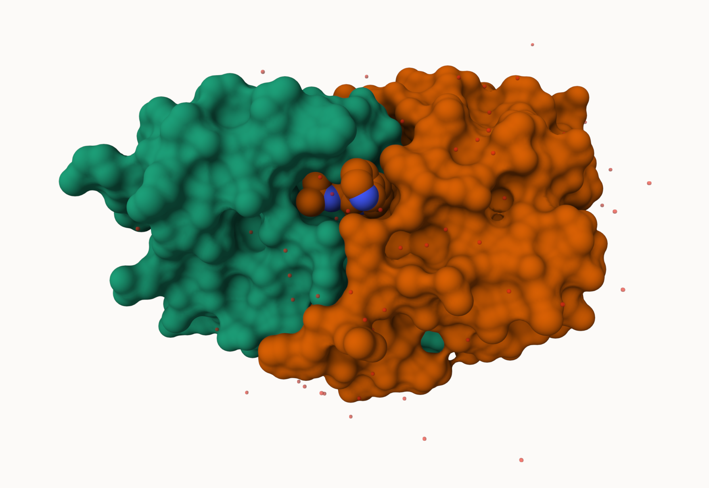
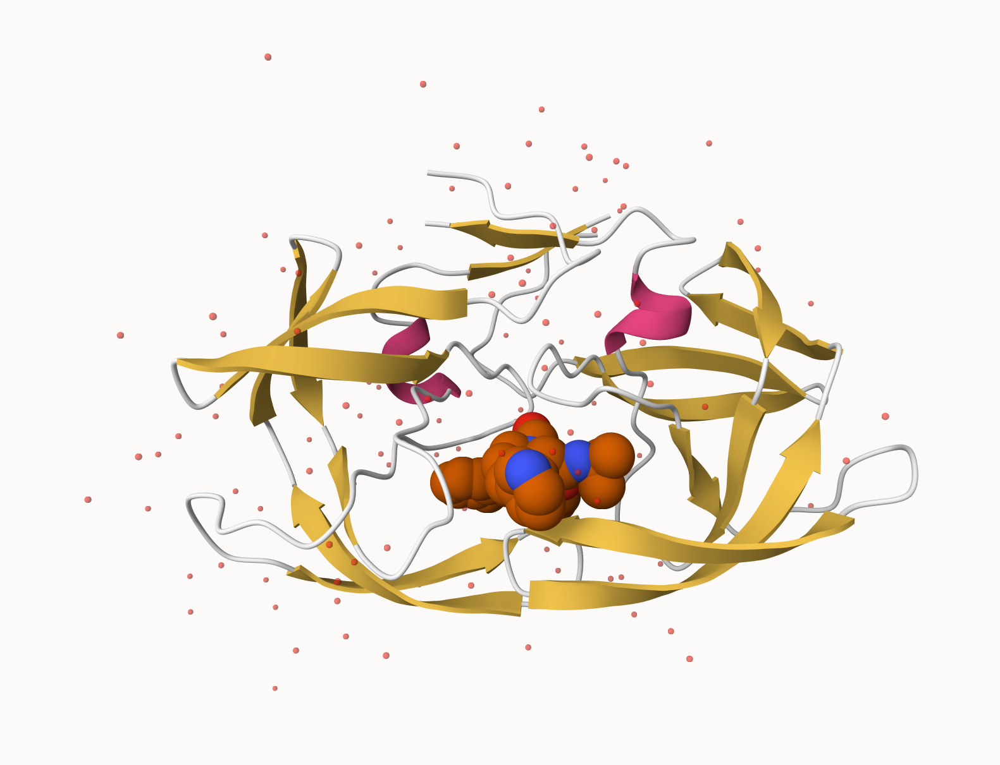
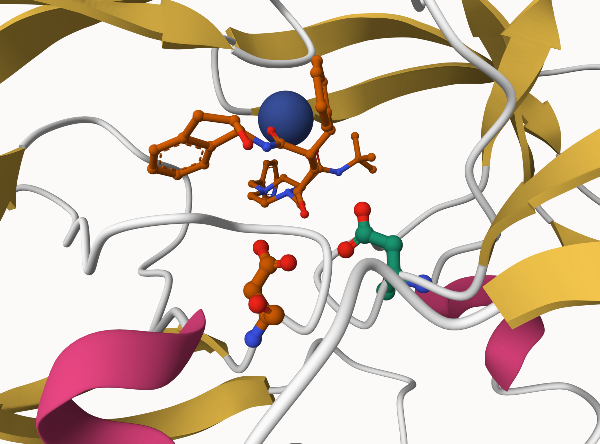

## The PDB Database

The [Protein Data Bank (PDB)](http://www.rcsb.org/) is the main repository of biomolecular structure data. Lets see what it is:

```{r}
stats <- read.csv("pdb_stats.csv", row.names = 1)
stats
```


> Q1: What percentage of structures in the PDB are solved by X-Ray and Electron Microscopy.

```{r}
n.sums <- colSums(stats)
n <- n.sums/n.sums["Total"]
round(n,digits=2)
```
> What is the total number of entries in the PDB

```{r}
n.sums["Total"]
```

> Q2: What proportion of structures in the PDB are protein?

```{r}
protein_total <- sum(stats$Total[1:3])
all_total <- sum(stats$Total)
protein_total / all_total

```

> Q3: Type HIV in the PDB website search box on the home page and determine how many HIV-1 protease structures are in the current PDB?

Skippped this one per Prof.


## Using Molestar

We can use the main [Molestar viewer online](https://molstar.org/viewer/) to look at our proteins. 



> Q. Generate and insert an image of the HIV-Pr cartoon colored by secondary structure showing the inhibitor (ligand) in space fill. 




> Q. One final image showing catalytic APS 25 as ball and stick and the all-important active site water molecule as spacefill. 




## The Bio3d package for structural bioinformatics

```{r}
library(bio3d)

hiv <- read.pdb("1HSG")
hiv
```

```{r}
head(hiv$atom)
```


```{r}
pdbseq(hiv)
```

Lets try out the new **bio3dview** package that is not yet on CRAN. We can use the **remotes** package to install any R package from GitHub

## Quick viewing of PDBs

```{r}
library(bio3dview)

sele <- atom.select(hiv, resno=25)
#view.pdb(hiv, backgroundColor = "grey",
#         highlight = sele,
#         highlight.style = "spacefill"
#         ) 
```

## Prediction of Protein flexibility

```{r}
adk <- read.pdb("6s36")
m <- nma(adk)
plot(m)
```

Write out our results as a trajectory movie:

```{r}
mktrj(m, file="results.pdb")
```


```{r}
#view.nma(m, pdb=adk)
```

## Comparative protein structure analysis with PCA

We will start with a database identifier, "1ake_A"

```{r}
library(bio3d)

id <- "1ake_A"
aa <- get.seq(id)

```

```{r}
aa
```

```{r}
blast <- blast.pdb(aa)
```

```{r}
head(blast$hit.tbl)
```

```{r}
hits <- plot(blast)
```

Peak at our "top hits"

```{r}
head(hits$pdb.id)

```

Now we can download these top hits, which will all be ADK structures in the PDB database.

```{r}
files <- get.pdb(hits$pdb.id, path="pdbs", split=T, gzip=T)
```


We need one packaage from BioConductor. To set this up we need to first install a package called **"BiocManager"** from CRAN

Now we can use the `install()` function from this package like this:
`BiocManager::install("msa")`

```{r}
pdbs <- pdbaln(files, fit=T,exefile="msa")
```
Let's have a peak at our structures after "fitting" aka superposing it:

```{r}
library(bio3dview)
view.pdbs(pdbs)
```

```{r}
view.pdbs(pdbs, colorScheme = "residue")
```

We can run functions like `rmsd()`,`rmsf()` and the best, `pca()`

```{r}
pc.xray <- pca(pdbs)
plot(pc.xray)
```

```{r}
plot(pc.xray,1:2)
```

Finally, let's make a movie of the major "motion" or structural differences in the dataset - we call this a "trajectory"

```{r}
mktrj(pc.xray, file = "results.pdb")
```

