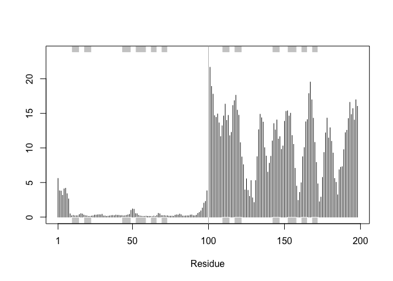

# Class 11: Alpha Fold
Paul Brencick (PID:A17668863)

## Background

In this hands-on session we will utilize AlphaFold to predict protein
structure from sequence (Jumper et al. 2021).

Without the aid of such approaches, it can take years of expensive
laboratory work to determine the structure of just one protein. With
AlphaFold we can now accurately compute a typical protein structure in
as little as ten minutes.

This major breakthrough (Figure 1) promises to place Molecular Biology
in a new era where we can visualize, analyze and interpret the
structures and functions of all proteins.

The PDB Database (main repository of experimental structures) only has
**~250k structures** (saw this in last lab). The main sequence database
has over **200 million** sequences! Only 0.125% of known sequences have
a known structure - this is called the “structure knowledge gap.”

``` r
(250000/200000000)*100
```

    [1] 0.125

- Structures are much harder to determine than sequences.
- They are expensive (average ~1 million each).
- They take an average of 3-5 years to complete

## EBI AlphaFold Database

The EBI has a database of pre-computed alphafold (AF) models called
AFDB. This is growing all the time and can be useful to check before
running AF ourselves.

## Running AlphaFold

We can download and run locally but we need a GPU or we can use “cloud”
computing to run this on someone else’s computer :D

We will use ColabFold \< https://github.com/sokrypton/ColabFold \>

We previously found there was no AFDB entry for our HIV sequence:

    >HIV-Pr-Dimer
    PQITLWQRPLVTIKIGGQLKEALLDTGADDTVLEEMSLPGRWKPKMIGGIGGFIKVRQYD
    QILIEICGHKAIGTVLVGPTPVNIIGRNLLTQIGCTLNF:PQITLWQRPLVTIKIGGQLK
    EALLDTGADDTVLEEMSLPGRWKPKMIGGIGGFIKVRQYDQILIEICGHKAIGTVLVGPT
    PVNIIGRNLLTQIGCTLNF

Here we will use AlphaFold2_mmseqs2

## Custom analysis of resulting models

In this section we will read the results of the more complicated HIV-Pr
dimer AlphaFold2 models into R with the help of the Bio3D package.

``` r
results_dir <- "hivprdimer_23119/" 
```

``` r
pdb_files <- list.files(path=results_dir,
                        pattern="*.pdb",
                        full.names = TRUE)

basename(pdb_files)
```

    [1] "hivprdimer_23119_unrelaxed_rank_001_alphafold2_multimer_v3_model_4_seed_000.pdb"
    [2] "hivprdimer_23119_unrelaxed_rank_002_alphafold2_multimer_v3_model_1_seed_000.pdb"
    [3] "hivprdimer_23119_unrelaxed_rank_003_alphafold2_multimer_v3_model_5_seed_000.pdb"
    [4] "hivprdimer_23119_unrelaxed_rank_004_alphafold2_multimer_v3_model_2_seed_000.pdb"
    [5] "hivprdimer_23119_unrelaxed_rank_005_alphafold2_multimer_v3_model_3_seed_000.pdb"

``` r
library(bio3d)

pdbs <- pdbaln(pdb_files, fit=TRUE, exefile="msa")
```

    Reading PDB files:
    hivprdimer_23119//hivprdimer_23119_unrelaxed_rank_001_alphafold2_multimer_v3_model_4_seed_000.pdb
    hivprdimer_23119//hivprdimer_23119_unrelaxed_rank_002_alphafold2_multimer_v3_model_1_seed_000.pdb
    hivprdimer_23119//hivprdimer_23119_unrelaxed_rank_003_alphafold2_multimer_v3_model_5_seed_000.pdb
    hivprdimer_23119//hivprdimer_23119_unrelaxed_rank_004_alphafold2_multimer_v3_model_2_seed_000.pdb
    hivprdimer_23119//hivprdimer_23119_unrelaxed_rank_005_alphafold2_multimer_v3_model_3_seed_000.pdb
    .....

    Extracting sequences

    pdb/seq: 1   name: hivprdimer_23119//hivprdimer_23119_unrelaxed_rank_001_alphafold2_multimer_v3_model_4_seed_000.pdb 
    pdb/seq: 2   name: hivprdimer_23119//hivprdimer_23119_unrelaxed_rank_002_alphafold2_multimer_v3_model_1_seed_000.pdb 
    pdb/seq: 3   name: hivprdimer_23119//hivprdimer_23119_unrelaxed_rank_003_alphafold2_multimer_v3_model_5_seed_000.pdb 
    pdb/seq: 4   name: hivprdimer_23119//hivprdimer_23119_unrelaxed_rank_004_alphafold2_multimer_v3_model_2_seed_000.pdb 
    pdb/seq: 5   name: hivprdimer_23119//hivprdimer_23119_unrelaxed_rank_005_alphafold2_multimer_v3_model_3_seed_000.pdb 

``` r
pdbs
```

                                   1        .         .         .         .         50 
    [Truncated_Name:1]hivprdimer   PQITLWQRPLVTIKIGGQLKEALLDTGADDTVLEEMSLPGRWKPKMIGGI
    [Truncated_Name:2]hivprdimer   PQITLWQRPLVTIKIGGQLKEALLDTGADDTVLEEMSLPGRWKPKMIGGI
    [Truncated_Name:3]hivprdimer   PQITLWQRPLVTIKIGGQLKEALLDTGADDTVLEEMSLPGRWKPKMIGGI
    [Truncated_Name:4]hivprdimer   PQITLWQRPLVTIKIGGQLKEALLDTGADDTVLEEMSLPGRWKPKMIGGI
    [Truncated_Name:5]hivprdimer   PQITLWQRPLVTIKIGGQLKEALLDTGADDTVLEEMSLPGRWKPKMIGGI
                                   ************************************************** 
                                   1        .         .         .         .         50 

                                  51        .         .         .         .         100 
    [Truncated_Name:1]hivprdimer   GGFIKVRQYDQILIEICGHKAIGTVLVGPTPVNIIGRNLLTQIGCTLNFP
    [Truncated_Name:2]hivprdimer   GGFIKVRQYDQILIEICGHKAIGTVLVGPTPVNIIGRNLLTQIGCTLNFP
    [Truncated_Name:3]hivprdimer   GGFIKVRQYDQILIEICGHKAIGTVLVGPTPVNIIGRNLLTQIGCTLNFP
    [Truncated_Name:4]hivprdimer   GGFIKVRQYDQILIEICGHKAIGTVLVGPTPVNIIGRNLLTQIGCTLNFP
    [Truncated_Name:5]hivprdimer   GGFIKVRQYDQILIEICGHKAIGTVLVGPTPVNIIGRNLLTQIGCTLNFP
                                   ************************************************** 
                                  51        .         .         .         .         100 

                                 101        .         .         .         .         150 
    [Truncated_Name:1]hivprdimer   QITLWQRPLVTIKIGGQLKEALLDTGADDTVLEEMSLPGRWKPKMIGGIG
    [Truncated_Name:2]hivprdimer   QITLWQRPLVTIKIGGQLKEALLDTGADDTVLEEMSLPGRWKPKMIGGIG
    [Truncated_Name:3]hivprdimer   QITLWQRPLVTIKIGGQLKEALLDTGADDTVLEEMSLPGRWKPKMIGGIG
    [Truncated_Name:4]hivprdimer   QITLWQRPLVTIKIGGQLKEALLDTGADDTVLEEMSLPGRWKPKMIGGIG
    [Truncated_Name:5]hivprdimer   QITLWQRPLVTIKIGGQLKEALLDTGADDTVLEEMSLPGRWKPKMIGGIG
                                   ************************************************** 
                                 101        .         .         .         .         150 

                                 151        .         .         .         .       198 
    [Truncated_Name:1]hivprdimer   GFIKVRQYDQILIEICGHKAIGTVLVGPTPVNIIGRNLLTQIGCTLNF
    [Truncated_Name:2]hivprdimer   GFIKVRQYDQILIEICGHKAIGTVLVGPTPVNIIGRNLLTQIGCTLNF
    [Truncated_Name:3]hivprdimer   GFIKVRQYDQILIEICGHKAIGTVLVGPTPVNIIGRNLLTQIGCTLNF
    [Truncated_Name:4]hivprdimer   GFIKVRQYDQILIEICGHKAIGTVLVGPTPVNIIGRNLLTQIGCTLNF
    [Truncated_Name:5]hivprdimer   GFIKVRQYDQILIEICGHKAIGTVLVGPTPVNIIGRNLLTQIGCTLNF
                                   ************************************************ 
                                 151        .         .         .         .       198 

    Call:
      pdbaln(files = pdb_files, fit = TRUE, exefile = "msa")

    Class:
      pdbs, fasta

    Alignment dimensions:
      5 sequence rows; 198 position columns (198 non-gap, 0 gap) 

    + attr: xyz, resno, b, chain, id, ali, resid, sse, call

RMSD is a standard measure of structural distance between coordinate
sets. We are able to use the `rmsd()` function to calculate the RMSD
between all pairs models.

``` r
rd <- rmsd(pdbs, fit=T)
```

    Warning in rmsd(pdbs, fit = T): No indices provided, using the 198 non NA positions

``` r
range(rd)
```

    [1]  0.000 14.754

Based on these rmsd values we can make a heatmap!

``` r
library(pheatmap)

colnames(rd) <- paste0("m",1:5)
rownames(rd) <- paste0("m",1:5)
pheatmap(rd)
```


Now lets plot the pLDDT values across all models. Additionally we will
improve the superposition of our models by finding the most consistent
“rigid core” common across all the models.

``` r
pdb <- read.pdb("1hsg")
```

      Note: Accessing on-line PDB file

``` r
core <- core.find(pdbs)
```

     core size 197 of 198  vol = 9836.196 
     core size 196 of 198  vol = 6800.793 
     core size 195 of 198  vol = 1322.091 
     core size 194 of 198  vol = 1032.249 
     core size 193 of 198  vol = 944.133 
     core size 192 of 198  vol = 894.048 
     core size 191 of 198  vol = 829.724 
     core size 190 of 198  vol = 766.628 
     core size 189 of 198  vol = 728.681 
     core size 188 of 198  vol = 693.317 
     core size 187 of 198  vol = 656.166 
     core size 186 of 198  vol = 622.063 
     core size 185 of 198  vol = 586.601 
     core size 184 of 198  vol = 565.358 
     core size 183 of 198  vol = 532.747 
     core size 182 of 198  vol = 511.421 
     core size 181 of 198  vol = 489.077 
     core size 180 of 198  vol = 468.599 
     core size 179 of 198  vol = 449.222 
     core size 178 of 198  vol = 433.122 
     core size 177 of 198  vol = 418.651 
     core size 176 of 198  vol = 405.069 
     core size 175 of 198  vol = 391.855 
     core size 174 of 198  vol = 381.006 
     core size 173 of 198  vol = 371.54 
     core size 172 of 198  vol = 355.539 
     core size 171 of 198  vol = 345.156 
     core size 170 of 198  vol = 335.982 
     core size 169 of 198  vol = 325.275 
     core size 168 of 198  vol = 313.603 
     core size 167 of 198  vol = 302.908 
     core size 166 of 198  vol = 293.343 
     core size 165 of 198  vol = 284.547 
     core size 164 of 198  vol = 277.932 
     core size 163 of 198  vol = 269.592 
     core size 162 of 198  vol = 258.167 
     core size 161 of 198  vol = 246.856 
     core size 160 of 198  vol = 239.073 
     core size 159 of 198  vol = 234.174 
     core size 158 of 198  vol = 226.309 
     core size 157 of 198  vol = 221.212 
     core size 156 of 198  vol = 214.951 
     core size 155 of 198  vol = 206.027 
     core size 154 of 198  vol = 197.301 
     core size 153 of 198  vol = 190.889 
     core size 152 of 198  vol = 185.403 
     core size 151 of 198  vol = 179.154 
     core size 150 of 198  vol = 174.709 
     core size 149 of 198  vol = 167.269 
     core size 148 of 198  vol = 160.866 
     core size 147 of 198  vol = 156.173 
     core size 146 of 198  vol = 148.395 
     core size 145 of 198  vol = 143.389 
     core size 144 of 198  vol = 138.428 
     core size 143 of 198  vol = 132.99 
     core size 142 of 198  vol = 126.924 
     core size 141 of 198  vol = 121.257 
     core size 140 of 198  vol = 116.407 
     core size 139 of 198  vol = 112.241 
     core size 138 of 198  vol = 107.813 
     core size 137 of 198  vol = 104.807 
     core size 136 of 198  vol = 100.968 
     core size 135 of 198  vol = 97.21 
     core size 134 of 198  vol = 92.54 
     core size 133 of 198  vol = 87.964 
     core size 132 of 198  vol = 85.621 
     core size 131 of 198  vol = 81.514 
     core size 130 of 198  vol = 77.627 
     core size 129 of 198  vol = 74.881 
     core size 128 of 198  vol = 72.642 
     core size 127 of 198  vol = 70.352 
     core size 126 of 198  vol = 68.627 
     core size 125 of 198  vol = 66.349 
     core size 124 of 198  vol = 64.019 
     core size 123 of 198  vol = 61.763 
     core size 122 of 198  vol = 58.758 
     core size 121 of 198  vol = 56.354 
     core size 120 of 198  vol = 54.129 
     core size 119 of 198  vol = 51.611 
     core size 118 of 198  vol = 49.502 
     core size 117 of 198  vol = 48.045 
     core size 116 of 198  vol = 46.489 
     core size 115 of 198  vol = 44.599 
     core size 114 of 198  vol = 43.185 
     core size 113 of 198  vol = 40.978 
     core size 112 of 198  vol = 39.029 
     core size 111 of 198  vol = 36.363 
     core size 110 of 198  vol = 33.953 
     core size 109 of 198  vol = 31.343 
     core size 108 of 198  vol = 29.304 
     core size 107 of 198  vol = 27.188 
     core size 106 of 198  vol = 25.655 
     core size 105 of 198  vol = 24.03 
     core size 104 of 198  vol = 22.504 
     core size 103 of 198  vol = 20.906 
     core size 102 of 198  vol = 19.803 
     core size 101 of 198  vol = 18.215 
     core size 100 of 198  vol = 15.652 
     core size 99 of 198  vol = 14.762 
     core size 98 of 198  vol = 11.574 
     core size 97 of 198  vol = 9.391 
     core size 96 of 198  vol = 7.327 
     core size 95 of 198  vol = 6.123 
     core size 94 of 198  vol = 5.592 
     core size 93 of 198  vol = 4.689 
     core size 92 of 198  vol = 3.66 
     core size 91 of 198  vol = 2.779 
     core size 90 of 198  vol = 2.147 
     core size 89 of 198  vol = 1.725 
     core size 88 of 198  vol = 1.158 
     core size 87 of 198  vol = 0.88 
     core size 86 of 198  vol = 0.682 
     core size 85 of 198  vol = 0.527 
     core size 84 of 198  vol = 0.37 
     FINISHED: Min vol ( 0.5 ) reached

Now the identified core position will be used as a basis for a more
suitable superposition in

``` r
core.inds <- print(core, vol=0.5)
```

    # 85 positions (cumulative volume <= 0.5 Angstrom^3) 
      start end length
    1     9  49     41
    2    52  95     44

``` r
xyz <- pdbfit(pdbs, core.inds, outpath="corefit_structures")
```

Now we can look at the RMSF between positions in the structure. It is a
measure of conformational variance along the structure

``` r
rf <- rmsf(xyz)

plotb3(rf, sse=pdb)
abline(v=100, col="gray", ylab="RMSF")
```



## Predicted Alignment Error for domains

AlphaFold produces an output called \***Predicted Aligned Error (PAE)**

``` r
library(jsonlite)

pae_files <- list.files(path=results_dir,
                        pattern=".*model.*\\.json",
                        full.names = TRUE)
```

``` r
pae1 <- read_json(pae_files[1],simplifyVector = TRUE)
pae5 <- read_json(pae_files[5],simplifyVector = TRUE)

attributes(pae1)
```

    $names
    [1] "plddt"   "max_pae" "pae"     "ptm"     "iptm"   

``` r
head(pae1$plddt) 
```

    [1] 90.81 93.25 93.69 92.88 95.25 89.44

We can also look at the max pae to make ranking models. We can see pae1
is better than 5 bc the lower the PAE score the better.

``` r
pae1$max_pae
```

    [1] 12.84375

``` r
pae5$max_pae
```

    [1] 29.59375

Lets make a plot of the number of residues by the pae score of number of
residues

``` r
plot.dmat(pae1$pae, 
          xlab="Residue Position (i)",
          ylab="Residue Position (j)",
          grid.col = "black",
          zlim=c(0,30))
```


``` r
plot.dmat(pae5$pae, 
          xlab="Residue Position (i)",
          ylab="Residue Position (j)",
          grid.col = "black",
          zlim=c(0,30))
```


## Residue conservation from alignment file

``` r
aln_file <- list.files(path=results_dir,
                       pattern=".a3m$",
                        full.names = TRUE)
aln_file
```

    [1] "hivprdimer_23119//hivprdimer_23119.a3m"

``` r
aln <- read.fasta(aln_file[1], to.upper = TRUE)
```

    [1] " ** Duplicated sequence id's: 101 **"
    [2] " ** Duplicated sequence id's: 101 **"

> How many sequences are in this alignment

``` r
dim(aln$ali)
```

    [1] 5397  132

Lets score residue conservation in the alignment with the `conserv()`
function

``` r
sim <- conserv(aln)

plotb3(sim[1:99], sse=trim.pdb(pdb, chain="A"),
       ylab="Conservation Score")
```


Conserved active Site residues D25, T26, G27, A28

``` r
con <- consensus(aln, cutoff = 0.9)
con$seq
```

      [1] "-" "-" "-" "-" "-" "-" "-" "-" "-" "-" "-" "-" "-" "-" "-" "-" "-" "-"
     [19] "-" "-" "-" "-" "-" "-" "D" "T" "G" "A" "-" "-" "-" "-" "-" "-" "-" "-"
     [37] "-" "-" "-" "-" "-" "-" "-" "-" "-" "-" "-" "-" "-" "-" "-" "-" "-" "-"
     [55] "-" "-" "-" "-" "-" "-" "-" "-" "-" "-" "-" "-" "-" "-" "-" "-" "-" "-"
     [73] "-" "-" "-" "-" "-" "-" "-" "-" "-" "-" "-" "-" "-" "-" "-" "-" "-" "-"
     [91] "-" "-" "-" "-" "-" "-" "-" "-" "-" "-" "-" "-" "-" "-" "-" "-" "-" "-"
    [109] "-" "-" "-" "-" "-" "-" "-" "-" "-" "-" "-" "-" "-" "-" "-" "-" "-" "-"
    [127] "-" "-" "-" "-" "-" "-"

For a final visualization of these functionally important sites we can
map this conservation score to the Occupancy column of a PDB file.

``` r
m1.pdb <- read.pdb(pdb_files[1])
occ <- vec2resno(c(sim[1:99], sim[1:99]), m1.pdb$atom$resno)
write.pdb(m1.pdb, o=occ, file="m1_conserv.pdb")
```


