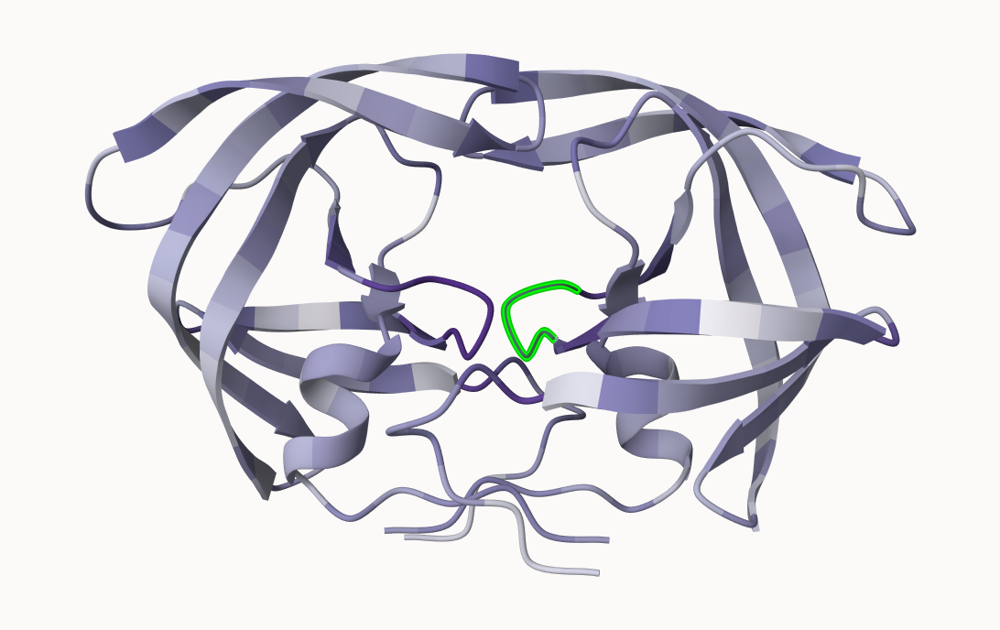

## Background

In this hands-on session we will utilize AlphaFold to predict protein structure from sequence (Jumper et al. 2021).

Without the aid of such approaches, it can take years of expensive laboratory work to determine the structure of just one protein. With AlphaFold we can now accurately compute a typical protein structure in as little as ten minutes.

This major breakthrough (Figure 1) promises to place Molecular Biology in a new era where we can visualize, analyze and interpret the structures and functions of all proteins.

The PDB Database (main repository of experimental structures) only has **~250k structures** (saw this in last lab). The main sequence database has over **200 million** sequences! Only 0.125% of known sequences have a known structure - this is called the "structure knowledge gap." 

```{r}
(250000/200000000)*100
```

- Structures are much harder to determine than sequences.
- They are expensive (average ~1 million each). 
- They take an average of 3-5 years to complete

## EBI AlphaFold Database

The EBI has a database of pre-computed alphafold (AF) models called AFDB. This is growing all the time and can be useful to check before running AF ourselves. 

## Running AlphaFold

We can download and run locally but we need a GPU or we can use "cloud" computing to run this on someone else's computer :D

We will use ColabFold < https://github.com/sokrypton/ColabFold >

We previously found there was no AFDB entry for our HIV sequence:

```
>HIV-Pr-Dimer
PQITLWQRPLVTIKIGGQLKEALLDTGADDTVLEEMSLPGRWKPKMIGGIGGFIKVRQYD
QILIEICGHKAIGTVLVGPTPVNIIGRNLLTQIGCTLNF:PQITLWQRPLVTIKIGGQLK
EALLDTGADDTVLEEMSLPGRWKPKMIGGIGGFIKVRQYDQILIEICGHKAIGTVLVGPT
PVNIIGRNLLTQIGCTLNF
```

Here we will use AlphaFold2_mmseqs2

## Custom analysis of resulting models

In this section we will read the results of the more complicated HIV-Pr dimer AlphaFold2 models into R with the help of the Bio3D package.

```{r}
results_dir <- "hivprdimer_23119/" 
```

```{r}
pdb_files <- list.files(path=results_dir,
                        pattern="*.pdb",
                        full.names = TRUE)

basename(pdb_files)
```

```{r}
library(bio3d)

pdbs <- pdbaln(pdb_files, fit=TRUE, exefile="msa")
pdbs
```

RMSD is a standard measure of structural distance between coordinate sets. We are able to use the `rmsd()` function to calculate the RMSD between all pairs models.

```{r}
rd <- rmsd(pdbs, fit=T)

range(rd)
```

Based on these rmsd values we can make a heatmap!

```{r}
library(pheatmap)

colnames(rd) <- paste0("m",1:5)
rownames(rd) <- paste0("m",1:5)
pheatmap(rd)
```

Now lets plot the pLDDT values across all models. Additionally we will improve the superposition of our models by finding the most consistent “rigid core” common across all the models.

```{r}
pdb <- read.pdb("1hsg")
core <- core.find(pdbs)

```

Now the identified core position will be used as a basis for a more suitable superposition in 

```{r}
core.inds <- print(core, vol=0.5)
xyz <- pdbfit(pdbs, core.inds, outpath="corefit_structures")

```

Now we can look at the RMSF between positions in the structure. It is a measure of conformational variance along the structure

```{r}
rf <- rmsf(xyz)

plotb3(rf, sse=pdb)
abline(v=100, col="gray", ylab="RMSF")
```

## Predicted Alignment Error for domains

AlphaFold produces an output called ***Predicted Aligned Error (PAE)**

```{r}
library(jsonlite)

pae_files <- list.files(path=results_dir,
                        pattern=".*model.*\\.json",
                        full.names = TRUE)
```

```{r}
pae1 <- read_json(pae_files[1],simplifyVector = TRUE)
pae5 <- read_json(pae_files[5],simplifyVector = TRUE)

attributes(pae1)
```

```{r}
head(pae1$plddt) 
```

We can also look at the max pae to make ranking models. We can see pae1 is better than 5 bc the lower the PAE score the better. 

```{r}
pae1$max_pae
pae5$max_pae

```
Lets make a plot of the number of residues by the pae score of number of residues
```{r}
plot.dmat(pae1$pae, 
          xlab="Residue Position (i)",
          ylab="Residue Position (j)",
          grid.col = "black",
          zlim=c(0,30))
```

```{r}
plot.dmat(pae5$pae, 
          xlab="Residue Position (i)",
          ylab="Residue Position (j)",
          grid.col = "black",
          zlim=c(0,30))
```

## Residue conservation from alignment file

```{r}
aln_file <- list.files(path=results_dir,
                       pattern=".a3m$",
                        full.names = TRUE)
aln_file

```

```{r}
aln <- read.fasta(aln_file[1], to.upper = TRUE)
```

> How many sequences are in this alignment

```{r}
dim(aln$ali)
```
Lets score residue conservation in the alignment with the `conserv()` function

```{r}
sim <- conserv(aln)

plotb3(sim[1:99], sse=trim.pdb(pdb, chain="A"),
       ylab="Conservation Score")
```
Conserved active Site residues D25, T26, G27, A28

```{r}
con <- consensus(aln, cutoff = 0.9)
con$seq

```

For a final visualization of these functionally important sites we can map this conservation score to the Occupancy column of a PDB file.

```{r}
m1.pdb <- read.pdb(pdb_files[1])
occ <- vec2resno(c(sim[1:99], sim[1:99]), m1.pdb$atom$resno)
write.pdb(m1.pdb, o=occ, file="m1_conserv.pdb")
```


