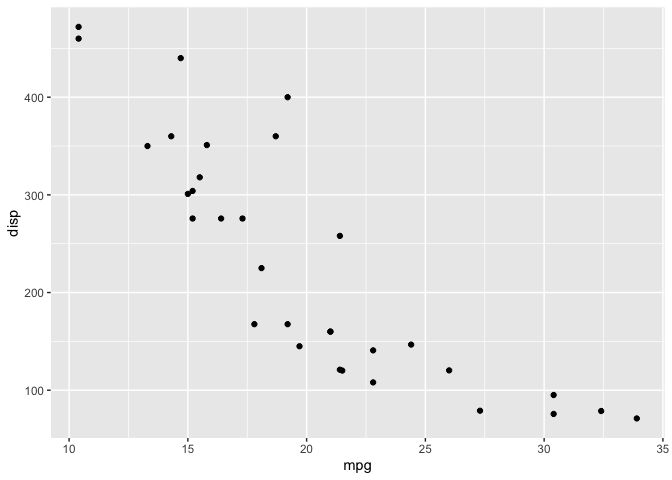

# Class 12

2026-02-13

## Section 1 - Proportion og G/G in a population

Download a CSV file from Ensemble \<
https://www.ensembl.org/Homo_sapiens/Variation/Sample?db=core;r=17:39895033-39895160;v=rs8067378;vdb=variation;vf=959672880#373531_tablePanel
\>

Here we read the CSV file

``` r
mxl <- read.csv("373531-SampleGenotypes-Homo_sapiens_Variation_Sample_rs8067378.csv")
head(mxl)
```

      Sample..Male.Female.Unknown. Genotype..forward.strand. Population.s. Father
    1                  NA19648 (F)                       A|A ALL, AMR, MXL      -
    2                  NA19649 (M)                       G|G ALL, AMR, MXL      -
    3                  NA19651 (F)                       A|A ALL, AMR, MXL      -
    4                  NA19652 (M)                       G|G ALL, AMR, MXL      -
    5                  NA19654 (F)                       G|G ALL, AMR, MXL      -
    6                  NA19655 (M)                       A|G ALL, AMR, MXL      -
      Mother
    1      -
    2      -
    3      -
    4      -
    5      -
    6      -

``` r
table(mxl$Genotype..forward.strand.)
```


    A|A A|G G|A G|G 
     22  21  12   9 

``` r
table(mxl$Genotype..forward.strand.) / nrow(mxl) * 100
```


        A|A     A|G     G|A     G|G 
    34.3750 32.8125 18.7500 14.0625 

Now lets look at a different population. I picked GBR population “great
britan”

``` r
gbr <- read.csv("373522-SampleGenotypes-Homo_sapiens_Variation_Sample_rs8067378.csv")
head(gbr)
```

      Sample..Male.Female.Unknown. Genotype..forward.strand. Population.s. Father
    1                  HG00096 (M)                       A|A ALL, EUR, GBR      -
    2                  HG00097 (F)                       G|A ALL, EUR, GBR      -
    3                  HG00099 (F)                       G|G ALL, EUR, GBR      -
    4                  HG00100 (F)                       A|A ALL, EUR, GBR      -
    5                  HG00101 (M)                       A|A ALL, EUR, GBR      -
    6                  HG00102 (F)                       A|A ALL, EUR, GBR      -
      Mother
    1      -
    2      -
    3      -
    4      -
    5      -
    6      -

Find proportion of G\|G

``` r
table(gbr$Genotype..forward.strand.)
```


    A|A A|G G|A G|G 
     23  17  24  27 

``` r
round(table(gbr$Genotype..forward.strand.) / nrow(gbr) * 100, 2)
```


      A|A   A|G   G|A   G|G 
    25.27 18.68 26.37 29.67 

This variant that is associated with childhood asthma is more frequent
in the GBR population than the MXL

Now lets dig into this further!

``` r
library(ggplot2)
ggplot(mtcars) + aes(x=mpg, y=disp) + geom_point()
```


``` r
ggplot(mtcars, aes(mpg, disp)) + geom_point()
```


