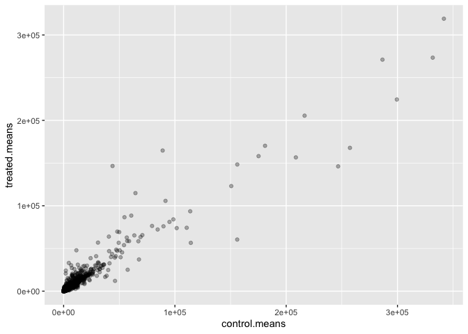
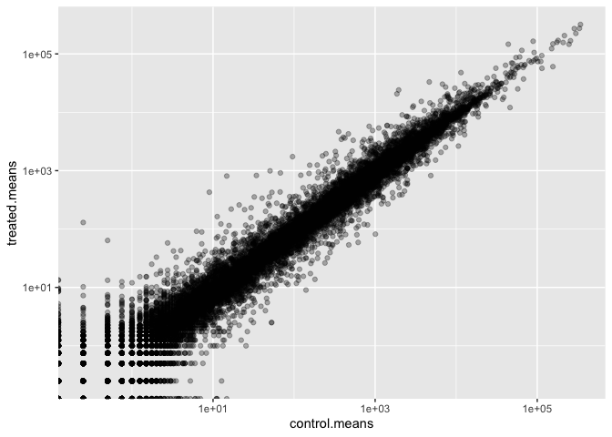
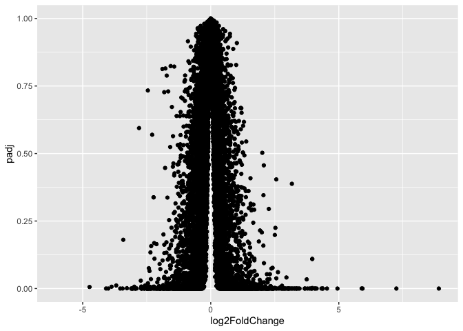
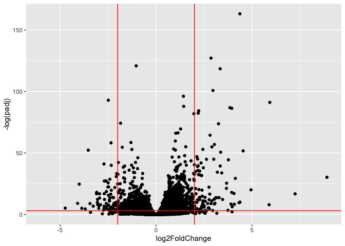
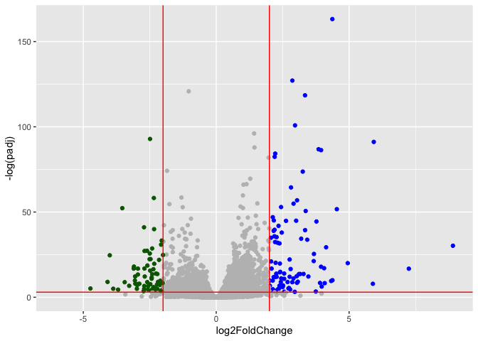

# Class 13: Transcriptomics and the analysis of RNA-Seq data
Paul Brencick (A17668863)

- [Background](#background)
- [Data Import](#data-import)
- [Check on metadata counts
  corespondance](#check-on-metadata-counts-corespondance)
- [Analysis Plan..](#analysis-plan)
- [Log2 units and fold change](#log2-units-and-fold-change)
- [Remove zero count genes](#remove-zero-count-genes)
- [DESeq analysis](#deseq-analysis)
- [Volcano Plot](#volcano-plot)
- [Add some plot annotaion](#add-some-plot-annotaion)
- [Save our results to a CSV file](#save-our-results-to-a-csv-file)

## Background

Today we will perform an RNA seq analysis on the effects of
Dexamethasone (hereafter “Dex”), a common steroid, on airway smooth
muscles (ASM) cell lines.

## Data Import

We need two things for this analysis:

- **countData**: a table with genes as rows and samples/experiments as
  columns
- **colData**: metadata about the columns (i.e. samples) in the main
  countData objects

``` r
counts <- read.csv("airway_scaledcounts.csv", row.names=1)
metadata <- read.csv("airway_metadata.csv")
```

Now lets have a peak at the data:

``` r
head(metadata)
```

              id     dex celltype     geo_id
    1 SRR1039508 control   N61311 GSM1275862
    2 SRR1039509 treated   N61311 GSM1275863
    3 SRR1039512 control  N052611 GSM1275866
    4 SRR1039513 treated  N052611 GSM1275867
    5 SRR1039516 control  N080611 GSM1275870
    6 SRR1039517 treated  N080611 GSM1275871

``` r
head(counts)
```

                    SRR1039508 SRR1039509 SRR1039512 SRR1039513 SRR1039516
    ENSG00000000003        723        486        904        445       1170
    ENSG00000000005          0          0          0          0          0
    ENSG00000000419        467        523        616        371        582
    ENSG00000000457        347        258        364        237        318
    ENSG00000000460         96         81         73         66        118
    ENSG00000000938          0          0          1          0          2
                    SRR1039517 SRR1039520 SRR1039521
    ENSG00000000003       1097        806        604
    ENSG00000000005          0          0          0
    ENSG00000000419        781        417        509
    ENSG00000000457        447        330        324
    ENSG00000000460         94        102         74
    ENSG00000000938          0          0          0

## Check on metadata counts corespondance

We need to check that the metadata matches the samlples in our count
data.

``` r
ncol(counts) == nrow(metadata)
```

    [1] TRUE

``` r
colnames(counts)
```

    [1] "SRR1039508" "SRR1039509" "SRR1039512" "SRR1039513" "SRR1039516"
    [6] "SRR1039517" "SRR1039520" "SRR1039521"

``` r
metadata$id
```

    [1] "SRR1039508" "SRR1039509" "SRR1039512" "SRR1039513" "SRR1039516"
    [6] "SRR1039517" "SRR1039520" "SRR1039521"

> Q1. How many genes are in this dataset?

``` r
nrow(counts)
```

    [1] 38694

> Q2. How many ‘control’ cell lines do we have?

``` r
sum(metadata$dex == "control")
```

    [1] 4

## Analysis Plan..

We have 4 replicates per conditions (“control” and “treated”). We want
to compare the control vs the treated to see which genes expression
levels change when we have the drug present.

We can go down each gene and see if the average values in control column
is different than the average treated column.

1.  Find which columns in `counts()` correspond to “control” samples
2.  Extract/select these columns
3.  Calculate an average value for each gene (i.e each row)

``` r
# The indices (aka positions) that are "control"
control.inds <- metadata$dex == "control"
```

``` r
# Extract/select these "control" columns from counts
control.counts <- counts[,control.inds]
```

``` r
# Calculate the mean for each gene (i.e row)
control.means <- rowMeans(control.counts)
```

> Q Do the same for the “treated” samples - Find the mean count value
> per gene

``` r
# The indices (aka positions) that are "treated"
treated.inds <- metadata$dex == "treated"
```

``` r
# Extract/select these "treated" columns from counts
treated.counts <- counts[,treated.inds]
```

``` r
# Calculate the mean for each gene (i.e row)
treated.means <- rowMeans(treated.counts)
```

Lets put these two mean values into a new data.frame, `meancounts`, for
easy book keeping.

``` r
meancounts <- data.frame(control.means,
                         treated.means)
head(meancounts)
```

                    control.means treated.means
    ENSG00000000003        900.75        658.00
    ENSG00000000005          0.00          0.00
    ENSG00000000419        520.50        546.00
    ENSG00000000457        339.75        316.50
    ENSG00000000460         97.25         78.75
    ENSG00000000938          0.75          0.00

> Q. Make a ggplot of average counts vs treated

``` r
library(ggplot2)
ggplot(meancounts) +
  aes(x = control.means, y = treated.means) +
  geom_point(alpha=0.3) 
```



This is screaming to be log transformed as it is so highly skewed…

``` r
ggplot(meancounts) +
  aes(x = control.means, y = treated.means) +
  geom_point(alpha=0.3) +
  scale_x_log10() +
  scale_y_log10()
```

    Warning in scale_x_log10(): log-10 transformation introduced infinite values.

    Warning in scale_y_log10(): log-10 transformation introduced infinite values.



## Log2 units and fold change

If we considered “treated”/“control” counts we will get a number that
tells us the change.

``` r
# No change
log2(20/20)
```

    [1] 0

``` r
# A doubling in the treated vs control
log2(40/20)
```

    [1] 1

``` r
log2(10/20)
```

    [1] -1

> Q. Add a new column called `log2fc` for log2 fold change of
> treated/control to our `meancounts` object.

``` r
meancounts$log2fc <- 
  log2(meancounts$treated.mean/
  meancounts$control.mean)
head(meancounts)
```

                    control.means treated.means      log2fc
    ENSG00000000003        900.75        658.00 -0.45303916
    ENSG00000000005          0.00          0.00         NaN
    ENSG00000000419        520.50        546.00  0.06900279
    ENSG00000000457        339.75        316.50 -0.10226805
    ENSG00000000460         97.25         78.75 -0.30441833
    ENSG00000000938          0.75          0.00        -Inf

## Remove zero count genes

Typically we would not consider zero count genes - as we have no data
bout them and they should be excluded from further consideration. These
lead to “funky” log2 fold change values 9e.g. divide by zero errors
ect.)

## DESeq analysis

We are missing any measure of significance from the work we have so far.
Let’s do this properly with **DESeq2** package.

``` r
library(DESeq2)
```

The DESeq2 package, like many bioconductor packages, want its imput in a
very specific way - a data structure setup with all the info it needs
for the calculations.

``` r
dds <- DESeqDataSetFromMatrix(countData = counts,
                       colData = metadata,
                       design = ~dex)
```

    converting counts to integer mode

    Warning in DESeqDataSet(se, design = design, ignoreRank): some variables in
    design formula are characters, converting to factors

The main function in this package is called `DESeq()` it will run the
full analysis for us on our `dds` imput object:

``` r
dds <- DESeq(dds)
```

    estimating size factors

    estimating dispersions

    gene-wise dispersion estimates

    mean-dispersion relationship

    final dispersion estimates

    fitting model and testing

Exrtract our results:

``` r
res <- results(dds)
head(res)
```

    log2 fold change (MLE): dex treated vs control 
    Wald test p-value: dex treated vs control 
    DataFrame with 6 rows and 6 columns
                      baseMean log2FoldChange     lfcSE      stat    pvalue
                     <numeric>      <numeric> <numeric> <numeric> <numeric>
    ENSG00000000003 747.194195      -0.350703  0.168242 -2.084514 0.0371134
    ENSG00000000005   0.000000             NA        NA        NA        NA
    ENSG00000000419 520.134160       0.206107  0.101042  2.039828 0.0413675
    ENSG00000000457 322.664844       0.024527  0.145134  0.168996 0.8658000
    ENSG00000000460  87.682625      -0.147143  0.256995 -0.572550 0.5669497
    ENSG00000000938   0.319167      -1.732289  3.493601 -0.495846 0.6200029
                         padj
                    <numeric>
    ENSG00000000003  0.163017
    ENSG00000000005        NA
    ENSG00000000419  0.175937
    ENSG00000000457  0.961682
    ENSG00000000460  0.815805
    ENSG00000000938        NA

## Volcano Plot

A useful summary figure of our results is often called a volcano plot.
Its basically a plot of log2 fold change values vs Adjusted P-values

> Q. Use ggplot to make a first version “volcano plot” of
> `log2FoldChange` vs `padj`

``` r
ggplot(res) +
  aes(log2FoldChange,padj) +
  geom_point()
```

    Warning: Removed 23549 rows containing missing values or values outside the scale range
    (`geom_point()`).



This is not very useful because the y-axis(P-value) is not really
helpful - we want to focus on low P-values

``` r
ggplot(res) +
  aes(log2FoldChange,-log(padj)) +
  geom_point() +
  geom_vline(xintercept = c(-2, 2), color="red") +
  geom_hline(yintercept = -log(0.05),col="red")
```

    Warning: Removed 23549 rows containing missing values or values outside the scale range
    (`geom_point()`).



## Add some plot annotaion

> Q. Add color to the points (genes) we care about, nice axis labels,
> and a useful title and a nice theme.

``` r
mycols <- rep("gray", nrow(res))
mycols[res$log2FoldChange >2] <- "blue"
mycols[res$log2FoldChange < -2] <- "darkgreen"
mycols[res$padj >= 0.05] <- "gray"
```

``` r
ggplot(res) +
  aes(log2FoldChange,-log(padj)) +
  geom_point(col=mycols) +
  geom_vline(xintercept = c(-2, 2), color="red") +
  geom_hline(yintercept = -log(0.05),col="red")
```

    Warning: Removed 23549 rows containing missing values or values outside the scale range
    (`geom_point()`).



## Save our results to a CSV file

``` r
write.csv(res,file="results.csv")
```
